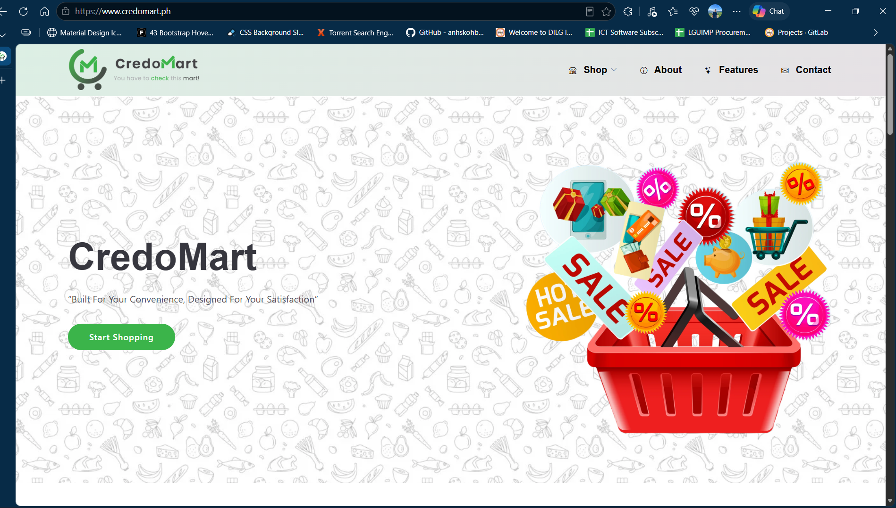
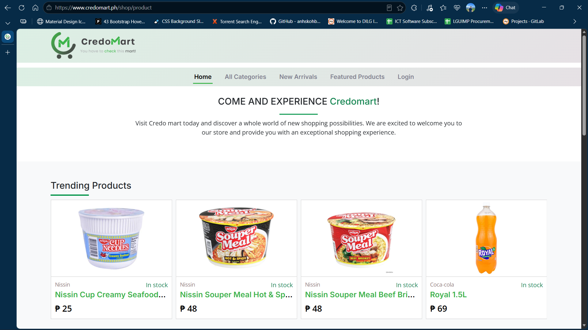
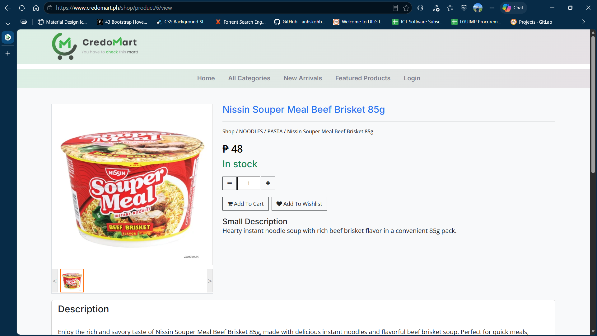
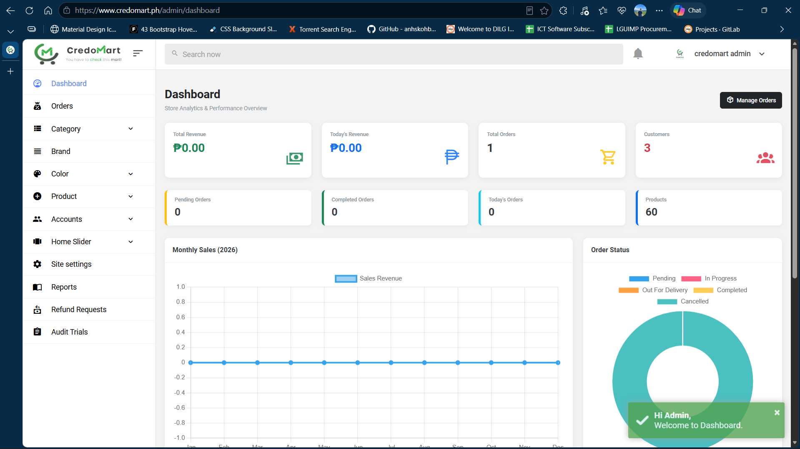

# 🛒 CredoMart – E-Commerce System

> A web-based e-commerce platform developed to provide
> customers with an online shopping experience and
> administrators with product and order management tools.

## 🌐 Live Website

https://www.credomart.ph/

## 📌 Project Overview

CredoMart was developed as an e-commerce platform where
customers can browse products, view product details,
and manage their online orders.

The administrative side provides functionality for
managing products and orders.

## ✨ Key Features

- Product catalog
- Product categories
- Product details
- Shopping experience
- Order management
- Product management
- Administrative tools

## 👨‍💻 My Role

Software Developer

I was involved in:

- Requirements gathering
- Business analysis
- Development
- Database management
- Testing
- Deployment
- Technical support

## 🛠️ Technologies

- PHP
- JavaScript
- jQuery
- HTML5
- CSS3
- Bootstrap
- MySQL
- Git

## 📸 Screenshots

### Homepage

### Shop

### View Product

### Admin Page

## 🎥 Demo

[Watch the CredoMart Demo](https://drive.google.com/file/d/1MYbUw7IOmYqomnpEUdIc2p06fGeOIPjD/view?usp=sharing)

## ⚠️ Source Code

The original source code is not publicly available because
this was developed as professional/client work.

This repository is provided as a portfolio case study.
